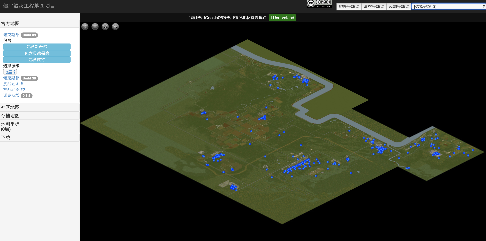

# 僵尸毁灭工程地图项目
  
下载《僵尸毁灭工程》地图图片  
  
## 环境需求  
  
- nodejs  

## 项目功能

- 汉化官方在线地图（完美汉化）
- 支持离线使用

**↑纯属扯淡**，本项目为扯淡项目，如果对你有用，纯属意外。

## 真・项目功能

 - 汉化官方在线地图（已汉化？）
 - 官方地图图片自动下载
>下载功能请查看:[map-image-download](map-image-download/README.md)
  
## 在线地址

- github: https://zlq4863947.github.io/pz-webmap/

## 调试地址

http://127.0.0.1:8081/?DEBUG=1

## 安装  
  
```  
 npm install
```  
  
## 运行网页项目 
  
```  
 npm start
 
 ```
  
运行后会显示如下



